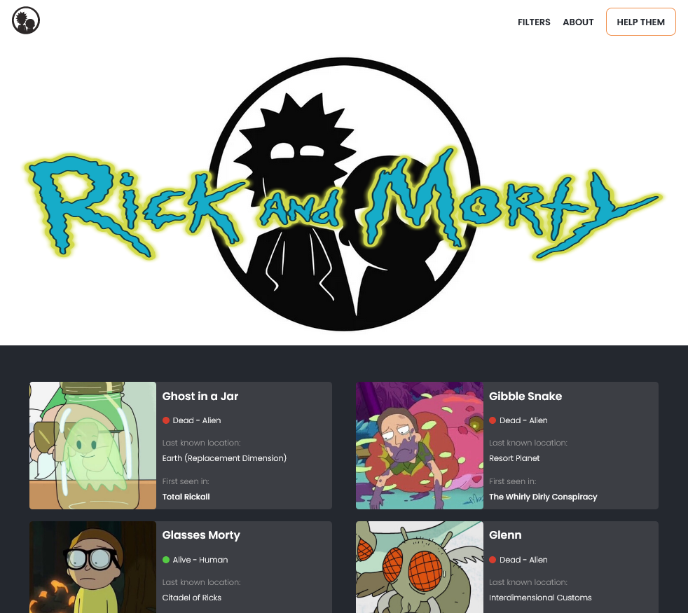

<p align="center"></img></p>
https://rickandmortywebsite.netlify.app/

# Ricky And Morty Web App

<a href="https://rickandmortyapi.com/">Rick And Morty API</a>.

## Things to notice

I got lazy, so i didn't code pages to list locations and episodes, only characters. Maybe i'll do it in the future, but for now i'll leave it as it is.
Feel free to do yourself.

## Running on your machine

````npm install````. To run, ````npx nx serve````, but if you do have the Nx cli installed, you can run it directly.

## Tecnologies used

This is a simple React SPA app. 
<a href="https://www.apollographql.com/docs/react/">Apollo Client</a> to fetch data.
<a href="https://emotion.sh/docs/introduction">Emotin</a> to handle css styles with js.
And thats pretty much it, the rest is just Nx stuff, or minor things. And of course, this project is built with Typescript.

This project was generated using [Nx](https://nx.dev).
